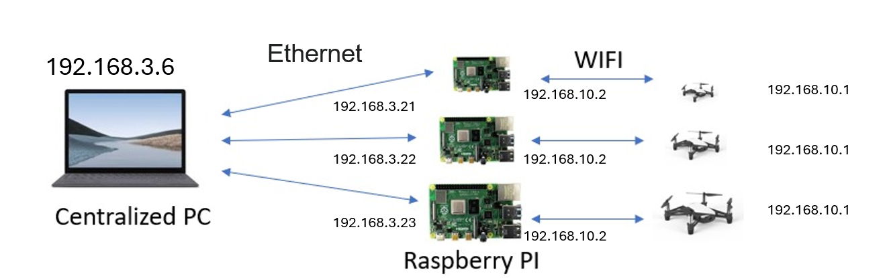

# Network Configuration Guide for Tello_ROS

This document provides detailed instructions for setting up the communication architecture required by the AirSwarm multi-drone system. It covers Raspberry Pi configuration, network bridging, IP forwarding, and multi-drone video stream handling.

## Table of Contents

- [Overview](#overview)
- [Tello Drone Default Settings](#tello-drone-default-settings)
- [Recommended IP Configuration](#recommended-ip-configuration)
- [Raspberry Pi Setup](#raspberry-pi-setup)
  - [Enable SSH and VNC](#enable-ssh-and-vnc)
  - [Connect to Tello WiFi](#connect-to-tello-wifi)
  - [Configure IP Forwarding](#configure-ip-forwarding)
  - [Make Settings Persistent](#make-settings-persistent)
- [Control Computer Configuration](#control-computer-configuration)
- [Testing the Connection](#testing-the-connection)
- [Troubleshooting](#troubleshooting)

## Overview


The AirSwarm communication architecture uses Raspberry Pi units as network bridges between the Tello drones and the control computer. This design addresses several challenges:

1. Tello drones have fixed IP addresses (192.168.10.1)
2. Multiple drones would create IP conflicts
3. Video streams all use the same port (11111)

By using Raspberry Pi units as intermediaries, we create a virtual network where each drone appears with a unique IP address and port configuration.

## Tello Drone Default Settings

Each Tello drone has the following factory settings:

- **Default IP**: 192.168.10.1
- **Command port**: 8889 (UDP)
- **Status port**: 8890 (UDP)
- **Video stream port**: 11111 (UDP)
- **WiFi SSID**: TELLO-XXXXXX (where XXXXXX is a unique identifier)

## Recommended IP Configuration

For multi-drone setups, we recommend using the following configuration:

| Drone | SSID | IP Address |
|-------|------|------------|
| Tello 0 | tello_5EAE22 | 192.168.3.6 |
| Tello 1 | tello_FDCFEB/tello_59D4C1 | 192.168.3.21 |
| Tello 2 | tello_5B4A8E | 192.168.3.22 |

Each drone connects to a dedicated Raspberry Pi, which routes the traffic to your control computer through a wired or wireless network.

## Raspberry Pi Setup

### Enable SSH and VNC

Before deployment, enable SSH and VNC on your Raspberry Pi for remote access:

1. Use `raspi-config` to enable SSH and VNC:
   ```bash
   sudo raspi-config
   ```
   
2. Navigate to "Interface Options" > "SSH" and enable it
3. Navigate to "Interface Options" > "VNC" and enable it
4. Exit and reboot if necessary

### Connect to Tello WiFi

Configure your Raspberry Pi to connect to the Tello's WiFi network:

1. Edit the wpa_supplicant.conf file:
   ```bash
   sudo nano /etc/wpa_supplicant/wpa_supplicant.conf
   ```

2. Add the following configuration:
   ```
   country=SG
   network={
       ssid="TELLO-FDCFEB"  # Replace with your Tello's SSID
       key_mgmt=NONE
   }
   ```

3. Save the file (Ctrl+O, then Ctrl+X to exit)

4. Restart network services:
   ```bash
   sudo systemctl restart wpa_supplicant
   sudo systemctl restart dhcpcd
   ```

5. Verify the connection:
   ```bash
   ip addr show wlan0
   ping 192.168.10.1
   ```

### Configure IP Forwarding

Set up network address translation (NAT) and IP forwarding to bridge between the Tello drone and your control computer:

1. Reset existing iptables rules:
   ```bash
   sudo iptables -F
   sudo iptables -X
   sudo iptables -Z
   sudo iptables -t nat -F
   ```

2. View current rules (optional):
   ```bash
   sudo iptables -L -v -n
   ```

3. Configure IP forwarding for each Tello drone (adjust as needed for your configuration):
   ```bash
   sudo iptables -t nat -A PREROUTING -s 192.168.3.6 -i eth0 -j DNAT --to-destination 192.168.10.1
   sudo iptables -t nat -A PREROUTING -s 192.168.10.1 -i wlan0 -j DNAT --to-destination 192.168.3.6
   sudo bash -c 'echo 1 > /proc/sys/net/ipv4/ip_forward'
   sudo iptables -A FORWARD -i wlan0 -o eth0 -j ACCEPT
   sudo iptables -A FORWARD -i eth0 -o wlan0 -j ACCEPT
   sudo iptables -t nat -A POSTROUTING -o eth0 -j MASQUERADE
   sudo iptables -t nat -A POSTROUTING -o wlan0 -j MASQUERADE
   sudo sh -c "iptables-save > /etc/iptables.rules"
   ```

### Make Settings Persistent

Ensure your IP forwarding rules survive reboots:

1. Edit rc.local:
   ```bash
   sudo nano /etc/rc.local
   ```

2. Add before `exit 0`:
   ```
   iptables-restore < /etc/iptables.rules
   ```

3. Alternative: Create an autostart script:
   ```
   su pi -c "exec /home/pi/Desktop/quick_script/autostart.sh"
   ```

4. If using the autostart script approach, create the script with the appropriate iptables commands

## Control Computer Configuration

For multi-drone setups, configure the control computer to handle multiple video streams from different drones:

```bash
sudo iptables -t nat -A PREROUTING -s 192.168.3.21 -p udp --dport 11111 -j REDIRECT --to-port 11118
sudo iptables -t nat -A PREROUTING -s 192.168.3.22 -p udp --dport 11111 -j REDIRECT --to-port 11119
```

These rules redirect the video streams from different drones to unique ports, preventing conflicts.

## Testing the Connection

After setting up the network architecture, you can test the video stream from each drone:

```bash
ffplay -f h264 -fflags nobuffer -flags low_delay -framedrop udp://192.168.3.21:11118 -framerate 30
ffplay -f h264 -fflags nobuffer -flags low_delay -framedrop udp://192.168.3.22:11119 -framerate 30
```

## Troubleshooting

If you encounter issues with the network configuration:

1. **Connection drops**: Ensure the Tello batteries are charged and the Raspberry Pi is within good range of the Tello
2. **No video stream**: Check if the video port forwarding is correctly configured
3. **Packet loss**: Try moving the Raspberry Pi closer to the Tello drone
4. **IP conflicts**: Verify that each drone has a unique IP address in your network
5. **Port forwarding issues**: Confirm that the iptables rules are correctly applied with `sudo iptables -L -v -n`

For more complex deployment scenarios or multiple drone setups, you may need to adjust the IP addresses and port configurations according to your specific requirements.
