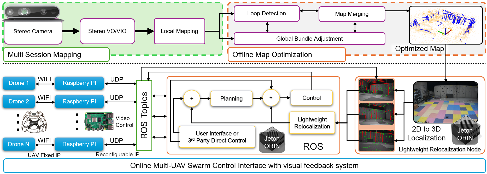
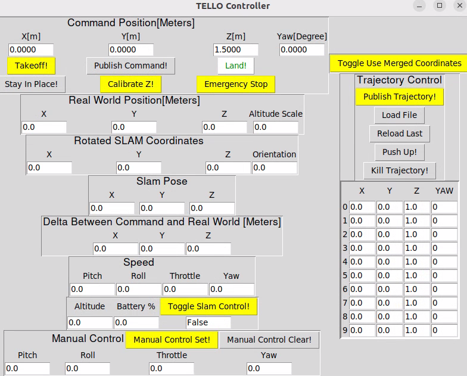
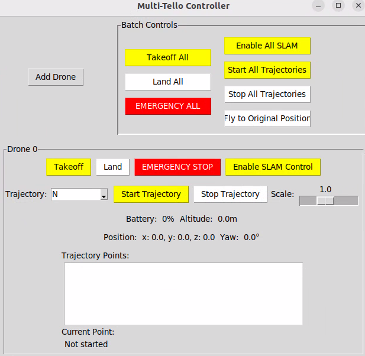

# Tello_ROS
A comprehensive ROS package for controlling DJI Tello drones with extensive capabilities for multi-drone coordination, real-time monitoring, and infrastructure-free visual SLAM localization. This repository is part of the AirSwarm system, which aims to democratize multi-UAV research by enabling low-cost commercially available drones to perform complex coordination tasks.

# Overview
The `tello_ros` package provides a complete ROS interface for DJI Tello drones, enabling:

- Comprehensive drone control through ROS topics
- Video streaming and processing capabilities
- Infrastructure-free localization using visual SLAM
- Multi-drone formation flying without external positioning systems
- User-friendly control interfaces
- Robust safety features

This package bridges the gap between ROS's powerful robotics ecosystem and the affordable Tello drone platform, making it ideal for research, education, and hobby projects.
# System Architecture

AirSwarm system consists of three primary functional layers:

**Mapping Subsystem [[SLAM System]](#airslam-optional)**: Implements multi-session mapping using stereo cameras, integrating visual-inertial odometry for initial pose estimation and local mapping with feature detection.

**Communication Architecture [[Network Configuration]](NETWORK_SETUP.md)**: Establishes a centralized network topology where COTS drones communicate via WiFi to Raspberry Pi units. These units serve as network bridges, utilizing a fixed-to-reconfigurable IP architecture that interfaces with ROS Topics.

**Control Framework [This package]**: Implements a versatile control stack based on ROS compatible with various COTS drones equipped with video feedback for planning and control functions with lightweight relocalization.
# 💻Installation
## Prerequisites
- ROS Noetic
- Python 3.10.12
- Git

## Setup

Create a catkin workspace:
```bash
mkdir -p ~/catkin_ws/src
cd ~/catkin_ws/src
```

Clone the repository:
```bash
git clone https://github.com/vvEverett/tello_ros.git
```

Build and source the workspace:
```bash
cd ~/catkin_ws
catkin_make
source ~/catkin_ws/devel/setup.bash
```

Add the setup source to your `.bashrc` for convenience:
```bash
echo "source ~/catkin_ws/devel/setup.bash" >> ~/.bashrc
source ~/.bashrc
```
## Modified DJITelloPy Installation

Our package uses a modified version of DJITelloPy that supports multi-drone video streaming:

```bash
cd ~/catkin_ws/src/tello_ros/src
git clone https://github.com/vvEverett/DJITelloPy.git
cd DJITelloPy
pip install -e .
```
## AirSLAM (Optional)
If you want to use SLAM for localization and navigation, you need to download and install AirSLAM or any other SLAM algorithm in the same ROS workspace. We have made modifications to ensure compatibility with this package.

For SLAM-based localization and navigation:

```bash
cd ~/catkin_ws/src
git clone https://github.com/vvEverett/AirSLAM.git
cd ~/catkin_ws
catkin_make
```

For detailed AirSLAM installation instructions, visit the [AirSLAM Repository](https://github.com/vvEverett/AirSLAM).
# 🚁 Features
## Node Parameters
### Single Drone Configuration

| Parameter | Default | Description |
|-----------|---------| ------------|
| ID | '' | Drone identifier |
| drone_ip | '192.168.10.1' | Drone IP address |
| video_port | '11111' | Video stream port |

Add the following line to your launch file to connect your drone:
```xml
<node name="tello_node" pkg="tello_ros" type="tello_node.py" output="screen"/>
```
### Multi-Drone Configuration

Example configuration in a launch file:

```xml
<!-- Multi-Drone nodes -->
<node pkg="tello_ros" type="multi_tello_node.py" name="multi_tello_node" output="screen">
    <rosparam>
        tello_configs:
            - id: "0"  # N
              ip: "192.168.10.1"
              video_port: 11111
            - id: "1"  # T
              ip: "192.168.3.21"
              video_port: 11118
            - id: "2"  # U
              ip: "192.168.3.22"
              video_port: 11119
    </rosparam>
</node>
```

### SLAM Control Node Parameters

| Parameter | Description |
|-----------|-------------|
| ID | Drone identifier (0, 1, 2, etc.) |
| POSE_TOPIC_NAME | Topic name for the SLAM pose data (e.g., `/exp0/AirSLAM/frame_pose`) |

Example configuration in a launch file:
```xml
<!-- SLAM Control nodes -->
<node pkg="tello_ros" type="tello_slam_control.py" name="tello_slam_control_0" output="screen">
    <param name="ID" value="0" />
    <param name="POSE_TOPIC_NAME" value="/exp0/AirSLAM/frame_pose" /> 
</node>

<node pkg="tello_ros" type="tello_slam_control.py" name="tello_slam_control_1" output="screen">
    <param name="ID" value="1" /> 
    <param name="POSE_TOPIC_NAME" value="/exp1/AirSLAM/frame_pose" />
</node>

<node pkg="tello_ros" type="tello_slam_control.py" name="tello_slam_control_2" output="screen">
    <param name="ID" value="2" /> 
    <param name="POSE_TOPIC_NAME" value="/exp2/AirSLAM/frame_pose" />
</node>
```
The `tello_slam_control.py` node serves as the critical bridge between visual SLAM localization and drone control. It subscribes to pose data from SLAM system, implements position-based PD control algorithms to transform world-frame coordinates to body-frame velocity commands, and manages coordinate system transformations. This node enables precise position tracking and trajectory following without requiring direct position control capabilities from the drone's native SDK.

## Published Topics

For each drone (replace {ID} with drone identifier):

| Topic | Message Type | Rate | Description |
|-------|--------------|------|-------------|
| tello{ID}/camera/image_raw | sensor_msgs/Image | 30Hz | RGB camera image |
| tello{ID}/camera/image_gray | sensor_msgs/Image | 30Hz | Grayscale camera image |
| tello{ID}/altitude | std_msgs/Float32 | 10Hz | Height data (meters) |
| tello{ID}/battery | std_msgs/Int32 | 10Hz | Battery percentage |
| tello{ID}/flight_data | std_msgs/String | 10Hz | Comprehensive flight status |
| tello{ID}/flight/attitude | geometry_msgs/Vector3Stamped | 10Hz | Attitude data (degrees) |
| tello{ID}/flight/velocity | geometry_msgs/TwistStamped | 10Hz | Velocity data (m/s) |

## Subscribed Topics

For each drone (replace {ID} with drone identifier):

| Topic | Message Type | Function |
|-------|--------------|----------|
| tello{ID}/cmd_vel | geometry_msgs/Twist | Velocity control (-1 to 1 range) |
| tello{ID}/takeoff | std_msgs/Empty | Takeoff command |
| tello{ID}/land | std_msgs/Empty | Landing command |
| tello{ID}/emergency | std_msgs/Empty | Emergency stop |
# 🎮Usage
## Basic Operations
### Take Pictures
```bash
# Launch camera node
roslaunch tello_ros take_pictures.launch

# Trigger picture capture
rosservice call /tello/take_picture
```
### Basic Commands
```bash
# Takeoff
rostopic pub /tello/takeoff std_msgs/Empty "{}"

# Land
rostopic pub /tello/land std_msgs/Empty "{}"

# Emergency Stop
rostopic pub /tello/emergency std_msgs/Empty "{}"
```

###  Velocity Control
```bash
rostopic pub /tello/cmd_vel geometry_msgs/Twist "
linear:
  x: 0.5
  y: 0.0
  z: 0.0
angular:
  z: 0.0
  " 
```
Send velocity commands to control the drone's movement. The x value controls forward/backward motion, y controls left/right, z controls up/down, and angular.z controls yaw rotation. All values should be between -1.0 and 1.0.
### Keyboard Control
```bash
roslaunch tello_ros keyboard_control.launch
```
### SLAM-Enabled Control
```bash
roslaunch tello_ros reloc_tello_slam.launch
```
## Multi-Drone Operations

### Multi-Drone SLAM
```bash
roslaunch tello_ros reloc_tello_slam_multi.launch
```
Multi-Tello drone connectivity with integrated SLAM control and visualization interface.
### Advanced Use Case - NTU Formation Flight
Our system supports sophisticated multi-drone formations, such as having three drones trace "NTU" letters in 3D space.
```bash
roslaunch tello_ros NTU.launch
```

- **Integrated Components**
  - `multi_tello_node.py`: Central control node
  - `multi_tello_ui.py`: Swarm control GUI
  - `tello_slam_control.py`: SLAM integration module

## Visual Interfaces
| Interface Type | Screenshot | Description |
|:-------------:|:----------:|:------------|
| **Single Drone UI** |  | A user-friendly interface for controlling individual drones with features including real-time video feed, position and attitude display, manual control options, and trajectory planning capabilities. |
| **Multiple Drone UI** |  | Advanced management system for simultaneous control of multiple drones, offering formation control, individual drone status monitoring, synchronization options, and convenient batch commands for coordinated operations. |
# ⚠️ Safety Features
The package implements numerous safety mechanisms:
- **Video Stream Resilience**: Independent video handler with auto-retry functionality
- **Thread Safety**: Secure frame capture and processing
- **Emergency Protocol**: Emergency stop via dedicated topic
- **Automatic Landing**: Safety landing on node shutdown
- **Error Handling**: Comprehensive exception management for connection issues
- **Status Monitoring**: Continuous status tracking and logging
- **Resource Management**: Separate cleanup routines for each drone

# 🔧 Troubleshooting

| Issue | Possible Cause | Solution |
|-------|----------------|----------|
| Connection Failed | WiFi Not Connected | Check WiFi Connection to Tello network |
| Video Stream Interruption | Network Instability | Reduce distance to drone or switch to a less congested WiFi channel |
| Multi-drone Control Issues | IP/Port Conflicts | Verify unique configurations in launch file |
| Unresponsive Commands | Low Battery | Check battery level (should be >20%) |
| Video Quality Issues | Bandwidth Limitations | Reduce video resolution or FPS in configuration |
| SLAM Localization Errors | Poor Environment Features | Ensure sufficient visual features in environment |
| Intermittent SLAM Tracking | Communication Failures | Our system is designed to recover from these - wait for reconnection |

# 🔗 Related Links

- [AirSLAM Repository](https://github.com/sair-lab/AirSLAM)
- [DJITelloPy Repository](https://github.com/damiafuentes/DJITelloPy)
# 📄 License
This project is licensed under the MIT License - see the LICENSE file for details.
